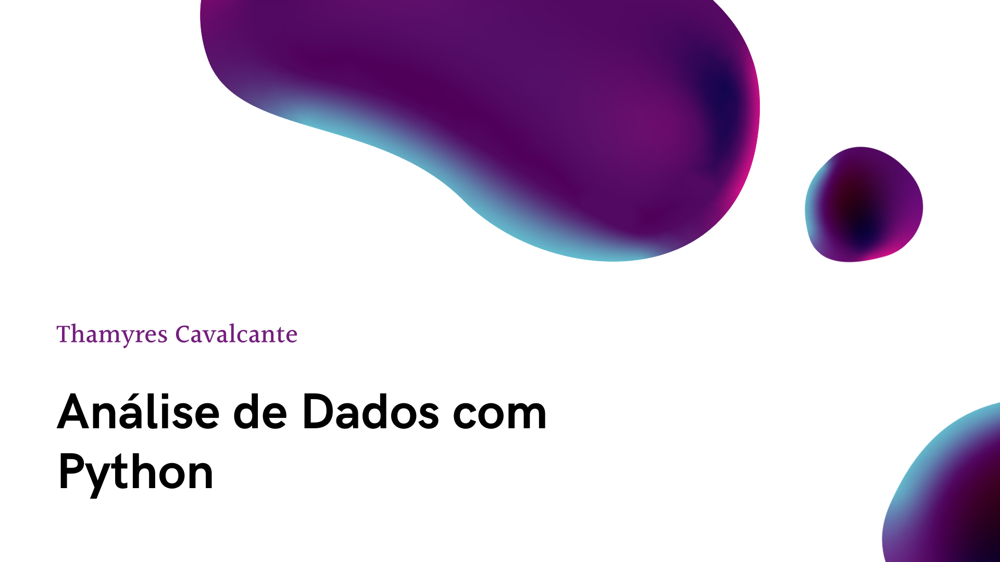
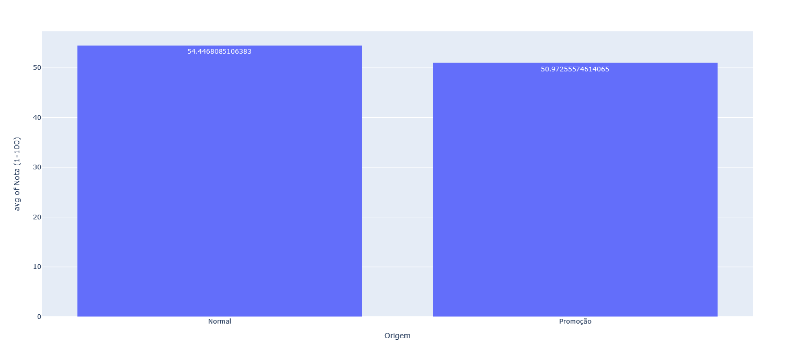
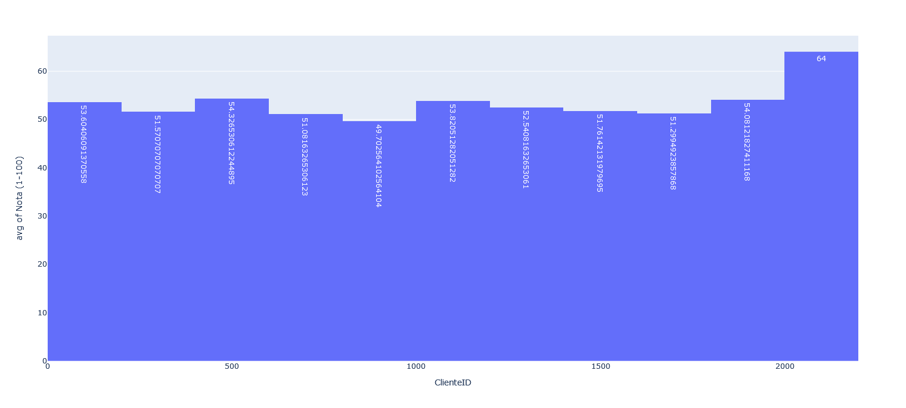
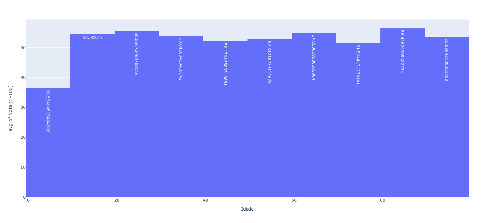
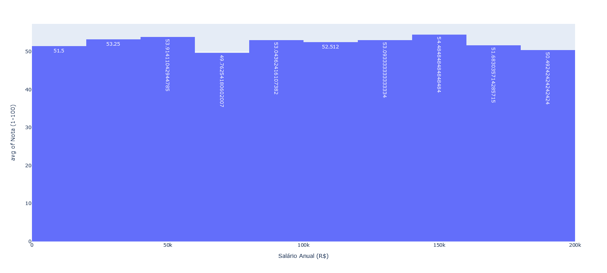
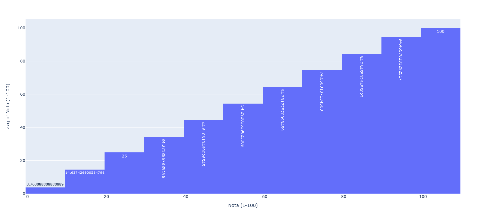
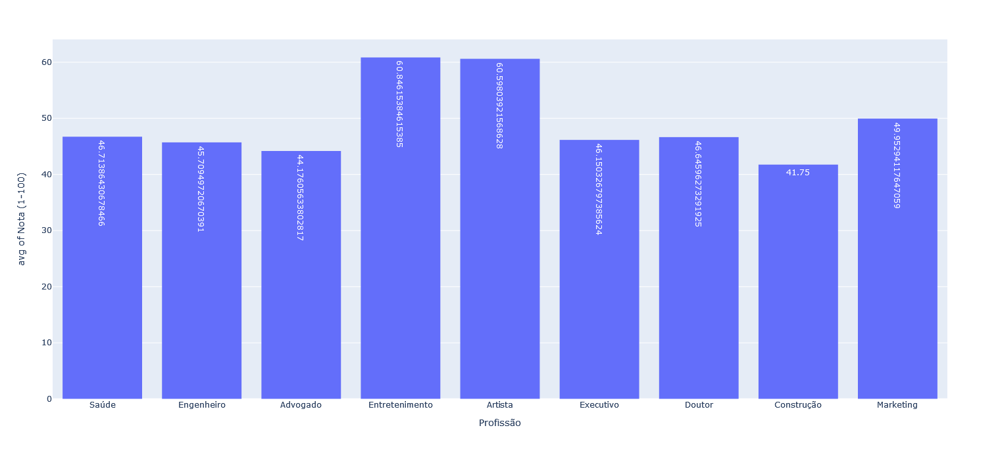
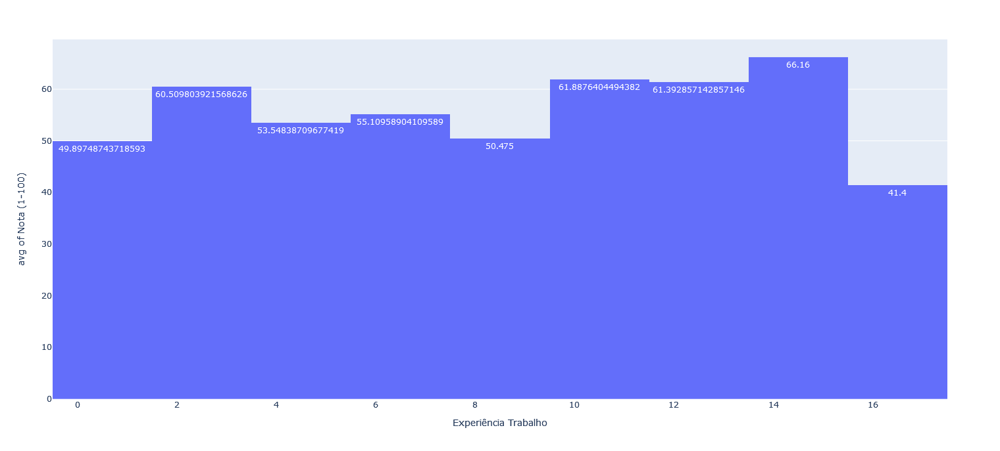
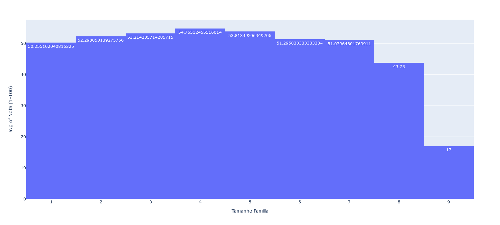

<!-- Inserir imagem tipo capa com largura maior  -->

# Projeto de Análise de Dados

Projeto desenvolvido em Python para analisar um banco de dados com informações de clientes de uma determinada empresa. Os dados passaram por um tratamento retirando os espaços vazios e transformando textos em números na coluna de Salário. Após tratamento foram gerados gráficos para melhor análise.
É possível identificar qual o perfil ideal de cliente para essa empresa, apenas analisando os gráficos gerados.

**Perfil ideal com base nos gráficos:**
- Acima de 15 anos (não tem muita diferença entre as faixas etárias depois disso)
- Faixa salarial nao parece fazer tanta diferença
- Areas de trabalho: Entretenimento e artista (evitar construção)
- Tem entre 10 e 15 anos de Experiencia de trabalho
- Com familias nao tão grandes (ate no maximo 7 pessoas)

<!-- Inserir imagem com a #vitrinedev ao final do link -->

## ✔️ Técnicas e tecnologias utilizadas
  - `VSCODE`;
  - `Pyhton`;
  - `GitHub`;
 

 

## 📁 Acesso ao projeto

[Veja o projeto final no repositório do GitHub](https://aluramidi-curso.vercel.app/).

Neste repositório você tem acesso ao banco de dados do cliente.

 

## 📚 Gráficos

 

## 📸 Gif
Criação dos gráficos

 

- Me siga nas redes sociais:
- [Linkedin](https://www.linkedin.com/in/thamyrescavalcante/)
- [Instagran](https://www.instagram.com/thamyres__cavalcante/)

 

---

Feito com ♥ by Thamyres Cavalcante.

